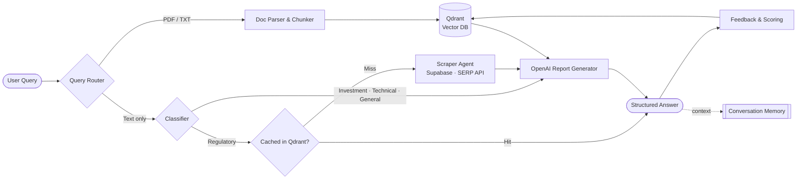
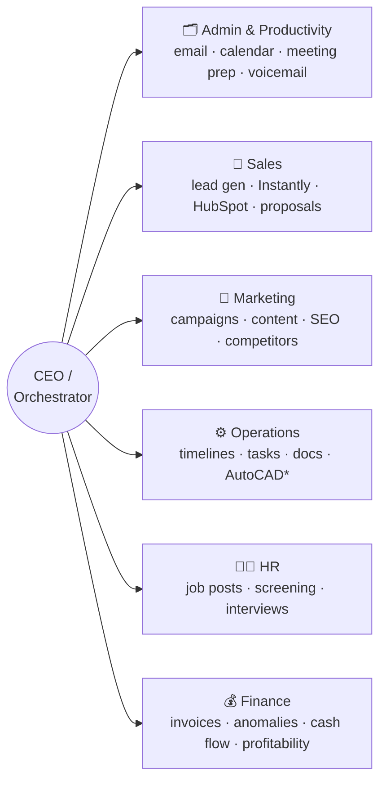

<!-- ═══════════════════════════ HEADER ═══════════════════════════ -->
<p align="center">
  
</p>

<p align="center">
  <a href="https://github.com/JAFFARCH">
    
  </a>
</p>

<p align="center">
  <a href="mailto:jaffaralichaudhary12@gmail.com"></a>
  <a href="https://www.upwork.com/freelancers/jaffaralichaudhary"></a>
  <a href="https://ieeexplore.ieee.org/document/10439171"></a>
  <a href="https://www.figma.com/design/lLic9lgE6QBvRO76jF1qsM/Complete?node-id=0%3A1&t=SAuV55LqOBUa40Dc-1"></a>
  
</p>

---

## `$ whoami`

```yaml
name:        Jaffar Ali
role:        Senior AI Engineer · Automation Architect · Data Engineer
focus:       [LLM Agents, RAG, Workflow Orchestration, Data Pipelines, Voice AI]
shipped_for: [Dynatrace, Kadoa, Trupeer, Wellbands, Humanic, Climbo, Legal Smarts, Audionotes, Imajinn AI]
research:    "AI-Driven Sentiment Analysis for Crypto Price Prediction" — IEEE Access (First Author)
philosophy:  "If a human does it twice, an agent should do it the third time."
currently:   Building multi-agent operating systems for executive teams
open_to:     Senior / Lead AI & Automation roles, high-impact contracts
```

## ⚡ Impact at a Glance

<table align="center">
  <tr>
    <td align="center"><h2>350M+</h2><sub>consumer records normalized<br/>via production ETL</sub></td>
    <td align="center"><h2>$1.36M+</h2><sub>revenue tracked in an<br/>Airtable × Shopify engine</sub></td>
    <td align="center"><h2>6</h2><sub>autonomous agents running<br/>CEO-level operations</sub></td>
    <td align="center"><h2>9+</h2><sub>SaaS / AI platforms<br/>shipped for clients</sub></td>
    <td align="center"><h2>1</h2><sub>peer-reviewed IEEE<br/>publication (1st author)</sub></td>
  </tr>
</table>

---

## 🏢 Platforms I've Engineered For

| Platform | Domain | What I Built |
|:--|:--|:--|
| [**Dynatrace**](https://www.dynatrace.com/) | Observability | AI-powered observability solutions to improve software performance and automate operational workflows |
| [**Wellbands**](https://wellbands.com/) | HealthTech | Led AI platform using quantum sensing + real-time inference; architected ML workflows, healthcare data pipelines and deployed the **Grace** AI assistant |
| [**Climbo**](https://www.climbo.com/) | SaaS / Reputation | Architected a white-label, **multi-tenant** review-management platform; real-time reputation tracking & automated feedback loops driving MRR growth |
| [**Humanic**](https://humanic.ai/) | MarTech | GPT-driven marketing automation using behavioral analytics for personalized email campaigns |
| [**Kadoa**](https://www.kadoa.com/) | Data | AI-driven data extraction & transformation platform for enterprise data workflows |
| [**Trupeer**](https://www.trupeer.ai/) | GenAI Video | AI that turns raw screen recordings into polished videos & guides — scripts, voiceovers, avatars, translations |
| [**Legal Smarts**](https://legalsmarts.net/) | LegalTech | AI platform with interactive document conversations and image generation |
| [**Audionotes**](https://www.audionotes.app/) | Productivity | Voice-to-text recording, transcription, organization & sharing |
| [**Imajinn AI**](https://imajinn.ai/) | Creative AI | Generative tools for high-quality images and designs |

---

## 🧠 Flagship Systems

<details open>
<summary><b>🔬 Deep Research Engine — n8n · Qdrant · OpenAI · Supabase · SERP API</b></summary>
<br/>

A fully AI-driven research engine that handles **document queries** (PDF / TXT) and **text-only queries**, detects intent and routes dynamically. It learns from feedback and caches answers for future queries.



**Engineering challenges solved:** heterogeneous input types · multi-DB/API integration · self-improving feedback loop → modular nodes, dynamic routing & a memory-feedback cycle that raised accuracy and cut manual work significantly.
▶️ [Watch the walkthrough](https://drive.google.com/file/d/1DfBRwbLjr8ZNX1Z0EMHdX3jfF-PH847g/view?usp=sharing)
</details>

<details open>
<summary><b>🏛️ CEO Operating System — 6 Autonomous Agents on n8n</b></summary>
<br/>


<sub>* planned integration</sub>
</details>

<details>
<summary><b>📈 End-to-End Marketing & Lead Automation — HubSpot · Zapier · Python · LLM · Ooma</b></summary>
<br/>

- **Quote Form Automation** — HubSpot trigger → Zapier extraction (budget, timeline, product) → custom Python pricing validation → personalized email, logged to HubSpot, Sheets & Drive
- **Adaptive Email Sequences** — de-duplication, timeline-aware cadence, LLM-generated content, auto-unenroll on reply
- **Reply Detection** — validates replies, updates HubSpot properties, halts active sequences
- **Call Intelligence** — Ooma recordings → AI transcription → LLM lead scoring, summaries, budget/timeline extraction → HubSpot

▶️ [Demo 1](https://www.loom.com/share/471e5d47b2894c638d5bb030574c32a5) · [Demo 2](https://www.loom.com/share/41ff22a80af649f8bd492b28867bd1ca)
</details>

<details>
<summary><b>🗄️ Large-Scale Consumer Data Pipeline — 350M+ Records · SQL · Python · Django</b></summary>
<br/>

High-throughput ETL that normalizes 350M+ consumer records with advanced **address-matching algorithms**, API-driven enrichment and modular workflow design — production-grade marketing data infrastructure.
</details>

<details>
<summary><b>📊 Multi-Entity Financial Dashboard — BigQuery · SQL Views · Looker Studio</b></summary>
<br/>

BigQuery pipeline with a **Master Mapping layer** that normalizes multi-entity QuickBooks data. SQL transformation views power Looker Studio dashboards for P&L benchmarking, balance-sheet analysis and cross-entity drill-downs — replacing months of manual Excel work with real-time insight.
</details>

<details>
<summary><b>🛒 Airtable × Shopify Automation Engine — $1.36M+ Tracked</b></summary>
<br/>

Centralized operational ecosystem replacing scattered spreadsheets: **2,500+ product variations**, real-time Shopify webhook sync, master inventory logs, data-integrity alerts, and an executive dashboard tracking **$1.36M+ revenue · 103K+ units · 15.6K+ orders**.
</details>

<details>
<summary><b>📞 AI Voice Calling Agent for Legal Services — Twilio · ElevenLabs · Whisper · GPT-4o mini</b></summary>
<br/>

Outbound voice agent with human-like conversations that automates lead engagement, meeting scheduling and follow-ups, with every interaction logged to Google Sheets.
</details>

---

## 🤖 Automation Portfolio

<table>
<tr>
<td valign="top" width="50%">

**AI Agents**
- [AI Email Sorting & Automation Agent](https://www.upwork.com/freelancers/jaffaralichaudhary?p=1968383197205786624)
- [AI Meeting Agent for Outlook](https://www.upwork.com/freelancers/jaffaralichaudhary?p=1968401635917406208)
- [OpenClaw — AI Personal Assistant](https://www.upwork.com/freelancers/jaffaralichaudhary?p=2047353592443817984)
- Chat Automation (RAG) — Langflow · Astra DB · Zapier
- Email Automation — n8n · MS Graph · OpenAI
- Meeting Summary Automation — Selenium · MS Graph

**Content & CRM**
- [Generate & Post AI Videos (n8n)](https://www.upwork.com/freelancers/jaffaralichaudhary?p=1968406219146256384)
- [Mailchimp Sync & CRM Enrichment](https://www.upwork.com/freelancers/jaffaralichaudhary?p=2047368479929475072)
- [AI-Powered CRM Enrichment (n8n)](https://www.upwork.com/freelancers/jaffaralichaudhary?p=2047361786592354304)
- GoHighLevel bulk personalized outreach
- Weekly Email → Google Docs AI reports

</td>
<td valign="top" width="50%">

**Workforce Analytics (Toggl · Monday · Slack)**
- Weekly Underwork Alert
- Weekly Work-Hours Email Report
- Uniform / Irregular Entries Detection
- Daily Work-Hours Slack Alerts
- Toggl → Monday.com Sync
- Consolidated Weekly Project Alerts

**Trading & Scraping**
- Real-time Binance Arbitrage Bot
- Multi-exchange AI Crypto Trading Platform
- Indeed Auto-Apply & Interview Scheduler
- Podia reverse-engineered Zapier triggers
- Meeting Scheduler & FAQ Chatbot

</td>
</tr>
</table>

---

## 📄 Research

> **AI-Driven Sentiment Analysis for Cryptocurrency Price Prediction** — *IEEE Access* · **First Author**
> An NLP + deep learning framework fusing sentiment from news, social media and financial reports into price forecasting, with sentiment-driven caution mechanisms for better risk assessment.
> 🔗 [ieeexplore.ieee.org/document/10439171](https://ieeexplore.ieee.org/document/10439171)

---

## 🛠️ Tech Arsenal

<p align="center"><b>AI / ML & LLMs</b><br/><br/>
  
  <br/>
  
  
  
  
  
  
  
  
</p>

<p align="center"><b>Automation & Integrations</b><br/><br/>
  
  
  
  
  
  
  
  
</p>

<p align="center"><b>Backend · Frontend · Data</b><br/><br/>
  
  <br/>
  
  <br/>
  
  
  
  
</p>

<p align="center"><b>Cloud & DevOps</b><br/><br/>
  
</p>

---

## 🤝 Let's Build Something

<p align="center">
  <b>Have a process that eats hours every week? I'll turn it into an agent.</b><br/><br/>
  <a href="mailto:jaffaralichaudhary12@gmail.com"></a>
  <a href="https://www.upwork.com/freelancers/jaffaralichaudhary"></a>
  <a href="https://instagram.com/jaffar.alich"></a>
</p>

<p align="center">
  
</p>
