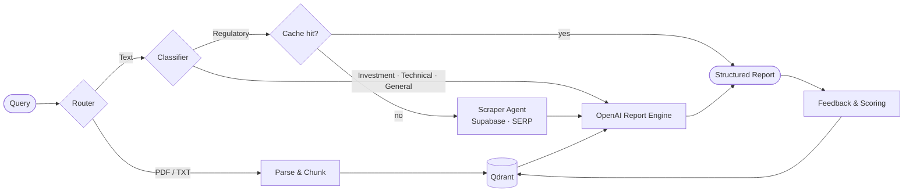

 

  

## Executive Summary

I am a **Senior AI Engineer and Automation Architect** who builds the systems behind the work — LLM agents that make decisions, pipelines that move hundreds of millions of records, and automation layers that let small teams operate like large ones.

My work sits at the intersection of **applied AI, backend engineering and data infrastructure**. I have contributed to platforms including **Dynatrace, Wellbands, Climbo, Humanic, Kadoa and Trupeer**, designed a six-agent operating system for executive teams, and published peer-reviewed research on NLP-driven market forecasting in *IEEE Access*.

I care about the unglamorous parts that make AI production-ready: routing, memory, retries, observability, token budgets, multi-tenancy and measurable business outcomes.

## Selected Engagements

| Platform | Domain | Contribution | Core Technologies |
|:--|:--|:--|:--|
| [**Dynatrace**](https://www.dynatrace.com/) | Observability | Developed AI-powered observability capabilities to improve software performance and automate operational workflows | ML · Automation · Cloud |
| [**Wellbands**](https://wellbands.com/) | HealthTech | **Led** development of an AI health platform using quantum sensing and real-time inference; architected end-to-end ML workflows, healthcare data pipelines and deployed the AI assistant **Grace** | Real-time inference · ML pipelines · LLM assistant |
| [**Climbo**](https://www.climbo.com/) | B2B SaaS | Contributed to the architecture of a **white-label, multi-tenant** review-management platform; optimized backend workflows, real-time reputation tracking and automated feedback loops that drove retention and MRR | Multi-tenant backend · Event workflows |
| [**Humanic**](https://humanic.ai/) | MarTech | GPT-based marketing automation using behavioral analytics to generate and send personalized campaigns | GPT · Behavioral analytics |
| [**Kadoa**](https://www.kadoa.com/) | Data Platforms | AI-driven data extraction and transformation for enterprise data operations | Extraction · ETL |
| [**Trupeer**](https://www.trupeer.ai/) | Generative Video | AI that converts raw screen recordings into studio-grade videos and guides — scripts, voiceovers, avatars, translation, branding | GenAI · Speech · Video |
| [**Legal Smarts**](https://legalsmarts.net/) | LegalTech | Conversational document intelligence and image generation for legal workflows | RAG · GenAI |
| [**Audionotes**](https://www.audionotes.app/) | Productivity | Voice capture, transcription, organization and sharing | Speech-to-text |
| [**Imajinn AI**](https://imajinn.ai/) | Creative AI | Generative tooling for high-quality images and designs | Diffusion · GenAI |

## Systems Architecture

A representative view of how I design automation platforms: heterogeneous event sources, a single LLM-routed orchestration core with memory and guardrails, specialised agents, and a shared knowledge layer that improves with every interaction.

## Case Studies

<b>01 &nbsp;·&nbsp; Deep Research Engine</b> &nbsp;—&nbsp; <code>n8n</code> <code>Qdrant</code> <code>OpenAI</code> <code>Supabase</code> <code>SERP API</code>

 

| | |
|:--|:--|
| **Problem** | Analysts needed one system that could answer both document-grounded and open-ended questions — regulatory, investment, technical — without re-researching what was already known. |
| **Architecture** | Query-type detection routes documents (PDF/TXT) into chunking and Qdrant vector storage; text queries are classified and, for regulatory intent, checked against cached answers before a scraper agent pulls from Supabase or SERP API. OpenAI produces structured reports; feedback and scores are written back. Conversation memory for context-aware follow-ups is in progress. |
| **Hard parts** | Multiple input modalities · integrating several databases and APIs · learning from feedback without drift |
| **Outcome** | Modular nodes, dynamic routing and a memory-feedback loop — higher answer accuracy and a significant reduction in manual research. |

▶ [Watch the walkthrough](https://drive.google.com/file/d/1DfBRwbLjr8ZNX1Z0EMHdX3jfF-PH847g/view?usp=sharing)

<b>02 &nbsp;·&nbsp; Executive Operating System — Six Autonomous Agents</b> &nbsp;—&nbsp; <code>n8n</code> <code>OpenAI</code> <code>HubSpot</code> <code>Instantly</code>

 

A modular agent system supporting CEO-level operations across the business (see architecture above).

| Agent | Responsibilities |
|:--|:--|
| **Admin & Productivity** | Email, calendar, meeting preparation, voicemail summaries, process documentation |
| **Sales** | Lead generation, outreach via Instantly, HubSpot CRM updates, proposal creation |
| **Marketing** | Campaign planning, content, keyword research, competitor tracking |
| **Operations** | Project timelines, task allocation, documentation — AutoCAD integration planned |
| **HR** | Job posting, candidate filtering, interview scheduling |
| **Finance** | Data extraction, invoicing, anomaly flags, cash-flow and project profitability tracking |

<b>03 &nbsp;·&nbsp; End-to-End Lead Intelligence &amp; Nurture Platform</b> &nbsp;—&nbsp; <code>HubSpot</code> <code>Zapier</code> <code>Python</code> <code>LLM</code> <code>Ooma</code>

 

- **Quote intake** — HubSpot submissions trigger Zapier extraction of budget, timeline and product; a custom Python node validates pricing before a personalised email is generated, logged in HubSpot and filed to Sheets and Drive.
- **Adaptive sequences** — duplicate checks, timeline-aware cadence, LLM-written content and automatic unenrolment on reply.
- **Reply detection** — validates inbound replies, updates HubSpot properties and halts active sequences.
- **Call intelligence** — Ooma recordings are transcribed and analysed by an LLM to score lead quality, summarise the call and capture budget and timeline, then logged to HubSpot and Drive.

**Outcome:** no lead missed, personalised communication at scale, zero manual hand-offs.
▶ [Demo 1](https://www.loom.com/share/471e5d47b2894c638d5bb030574c32a5) · [Demo 2](https://www.loom.com/share/41ff22a80af649f8bd492b28867bd1ca)

<b>04 &nbsp;·&nbsp; Consumer Data Platform — 350M+ Records</b> &nbsp;—&nbsp; <code>SQL</code> <code>Python</code> <code>Django</code>

 

Architected high-throughput pipelines to process and normalise **350M+ consumer records** — SQL transformations, Python ETL orchestration and Django backend services, with advanced **address-matching algorithms**, API-driven enrichment and modular workflow design for production-grade marketing data infrastructure.

<b>05 &nbsp;·&nbsp; Multi-Entity Financial Intelligence</b> &nbsp;—&nbsp; <code>BigQuery</code> <code>SQL</code> <code>Looker Studio</code> <code>QuickBooks</code>

 

A BigQuery pipeline with a **Master Mapping layer** that standardises and consolidates multi-entity QuickBooks data. SQL views feed interactive Looker Studio dashboards for P&amp;L benchmarking, balance-sheet analysis and cross-entity drill-downs — replacing months of manual Excel work with real-time, accurate reporting and giving leadership cross-entity visibility.

<b>06 &nbsp;·&nbsp; Commerce Operations Engine — $1.36M+ Tracked</b> &nbsp;—&nbsp; <code>Airtable</code> <code>Shopify</code> <code>Webhooks</code>

 

Replaced scattered spreadsheets with a centralised Airtable ecosystem managing **2,500+ product variations**. Low-code scripting and real-time webhooks sync Shopify orders, daily master inventory and product creation, with automated data-integrity alerts. An executive dashboard tracks **$1.36M+ revenue, 103K+ units and 15.6K+ orders** with collection-level analytics — a single source of truth for the business.

<b>07 &nbsp;·&nbsp; Conversational Voice Agent for Legal Services</b> &nbsp;—&nbsp; <code>Twilio</code> <code>ElevenLabs</code> <code>Whisper</code> <code>GPT-4o mini</code>

 

Outbound voice agent combining Twilio calling, ElevenLabs synthesis, Whisper and Google Speech for audio processing, and GPT-4o mini for natural dialogue. Automates lead engagement, meeting scheduling and follow-ups, with every interaction tracked in Google Sheets.

<b>08 &nbsp;·&nbsp; Weekly Email Intelligence Reports</b> &nbsp;—&nbsp; <code>n8n</code> <code>Gmail</code> <code>Python</code> <code>OpenAI</code> <code>Google Docs</code>

 

Webhook-triggered workflow that fetches client email, parses it with Python, groups by sender and summarises with GPT into formatted Google Docs reports delivered to client partners. Solved OpenAI token limits, dynamic Docs generation over OAuth and grouping accuracy — fully automated reporting.

## Automation Catalogue

<table>
<tr>
<td valign="top" width="33%">

**AI Agents**
- [Email Sorting &amp; Automation Agent](https://www.upwork.com/freelancers/jaffaralichaudhary?p=1968383197205786624)
- [Outlook Meeting Agent](https://www.upwork.com/freelancers/jaffaralichaudhary?p=1968401635917406208)
- [OpenClaw — Personal AI Assistant](https://www.upwork.com/freelancers/jaffaralichaudhary?p=2047353592443817984)
- RAG email chatbot — Langflow · Astra DB
- Outlook triage — MS Graph · OpenAI
- Meeting summaries — Selenium · MS Graph
- Meeting scheduler &amp; FAQ bot

</td>
<td valign="top" width="33%">

**Revenue &amp; CRM**
- [AI Video Generation &amp; Posting](https://www.upwork.com/freelancers/jaffaralichaudhary?p=1968406219146256384)
- [Mailchimp Sync &amp; CRM Enrichment](https://www.upwork.com/freelancers/jaffaralichaudhary?p=2047368479929475072)
- [AI CRM Data Enrichment](https://www.upwork.com/freelancers/jaffaralichaudhary?p=2047361786592354304)
- GoHighLevel personalised bulk outreach
- Podia triggers via reverse-engineered Zapier flows
- Indeed auto-apply &amp; interview scheduler

</td>
<td valign="top" width="33%">

**Workforce &amp; Trading**
- Toggl → Monday.com sync
- Weekly under-work detection
- Irregular time-entry detection
- Daily &amp; weekly hours reporting
- Consolidated Slack project alerts
- Binance real-time arbitrage bot
- Multi-exchange AI trading platform

</td>
</tr>
</table>

## Research

> **AI-Driven Sentiment Analysis for Cryptocurrency Price Prediction**
> *IEEE Access* &nbsp;·&nbsp; **First Author** &nbsp;·&nbsp; [ieeexplore.ieee.org/document/10439171](https://ieeexplore.ieee.org/document/10439171)
>
> A machine-learning framework that fuses NLP-derived sentiment from news, social media and financial reports with deep-learning price models. Sentiment-driven caution mechanisms improve risk assessment and trading strategy in highly volatile markets.

## Engineering Principles

- **Design for failure first** — retries, idempotency, dead-letter paths and alerting before the happy path is polished.
- **Route, don't prompt harder** — classification and dynamic routing beat one giant prompt.
- **Memory is a product feature** — every answer, score and correction should make the next run better.
- **Measure the business, not the model** — hours saved, leads converted, revenue tracked.
- **Build for the second tenant** — modular, multi-tenant architecture from day one.

## Technical Stack

<table>
<tr><td width="170"><b>AI / ML</b></td><td>

&nbsp;     
</td></tr>
<tr><td><b>Vector &amp; Data</b></td><td>

&nbsp;    
</td></tr>
<tr><td><b>Orchestration</b></td><td>
         
</td></tr>
<tr><td><b>Backend &amp; Web</b></td><td>

</td></tr>
<tr><td><b>Cloud &amp; DevOps</b></td><td>

</td></tr>
</table>

### Have a workflow that costs your team hours every week?
**I'll architect the system that runs it for you.**

 

&nbsp;

  

